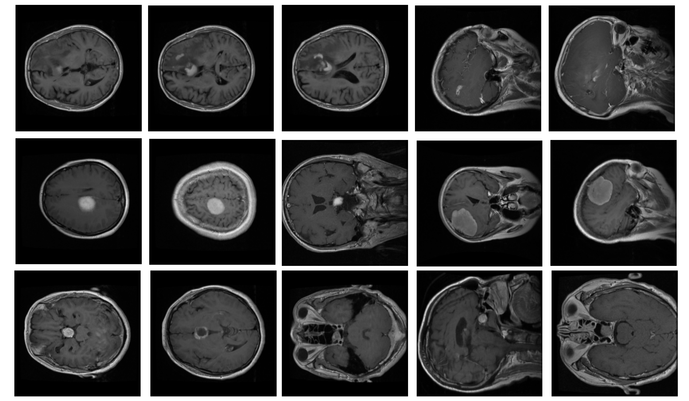
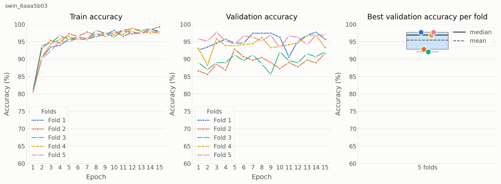

# Classification of MRI brain-tumor images using a SWIN transformer model
This repository implements training and 5-fold cross-validation procedures for a SWIN transformer 
that learns to classify MRI brain tumor images in 3 categories: meningioma, glioma, and pituitary 
tumors. 

The dataset for this project has been prepared by Jun Cheng et al. [1, 2]. It consists of T1-weighted 
contrast-enhanced images from 233 patients with meningioma (708 images), 
glioma (1426 images), and pituitary tumors (930 images). The dataset can be downloaded from:

https://figshare.com/articles/dataset/brain_tumor_dataset/1512427

<p style="text-align: center;">

</p>
Figure 1: Examples of brain tumor MRI images from the dataset showing glioma (top), meningioma (middle) 
and pituitary (bottom) tumors. 

## Required Python modules

- h5py
- numpy
- pandas
- PIL
- torch
- torchvision
- tqdm

## Workflow

- Download the dataset from the location mentioned above.
- Use `generate_data.py` to convert the downloaded dataset into a dataset 
that can be used to run the training/evaluation algorithms. For example,  
it converts images stored inside matlab files to png files. 
- Use `swin_train.py` to train a SWIN transformer to classify the MRI brain tumor
dataset into 3 classes and evaluate performance using a 5-fold cross-validation 
procedure. 
- Use `generate_plots.py` to visualize results.

## Commands
All utility commands described here accept a `-h` option to see the list of 
arguments and their meaning. 

### Data generation
```text
python generate_data.py -inp INPUT_DIR_PATH -out OUTPUT_DIR_PATH
```
Argument values:

`INPUT_DIR_PATH`: Path to a directory that contains the unzipped downloaded data.

`OUTPUT_DIR_PATH`: Path to a directory that will contain the data prepared for training 
a SWIN transformer.

### SWIN transformer training

```text
python swin_train.py --data_dir_path DATA_DIR_PATH \
                     --results_dir_path RESULTS_DIR_PATH \
                     --model_size MODEL_SIZE \
                     --model_version MODEL_VERSION \
                     --epochs NUM_OF_EPOCHS \
                     --lrate LEARNING_RATE \
                     --batch BATCH_SIZE \
                     --keyword KEYWORD \
                     --gpu
```
Argument values:

`DATA_DIR_PATH`: Path to the directory that contains the data for training the model.

`RESULTS_DIR_PATH`: Path to the directory that will contain the results (trained models and logs).

`MODEL_SIZE`: Size of a SWIN transformer. It can be either tiny, small, or base. Default: tiny.

`MODEL_VERSION`: Version of a SWIN transformer. It can be either v1 or v2. Default: v1.

`NUM_OF_EPOCHS`: Number of training epochs. Default: 10.

`LEARNING_RATE`: Learning rate. Default: 0.0001.

`BATCH_SIZE`: Batch size. Default: 16.

`KEYWORD`: A word that will be included in file names of files storing results. Default: swin.

Flags:

`--gpu`: If the flag is specified, the training procedure runs using a GPU if available.

### Result visualizations

```text
python generate_plots.py -res RESULTS_DIR_PATH -save FIGURE_DIR_PATH
```

Arguments:

`RESULTS_DIR_PATH`: A path to a directory that stores the results from training a SWIN transformer. 

`FIGURE_DIR_PATH`: A path to a directory that will store a figure with learning curves and a boxplot of 
per-fold accuracy values. If omitted, the figure is displayed on the screen, but not saved.

### ID decoding
Each attempt at training a SWIN transformer receives and ID, which appears in file names 
of logs and models. This ID uniquely identifies a particular run. The ID is a timestamp 
encoded as HEX digits. Use the following command to decode the ID:

```text
python ts_decode.py -hex ID_VALUE
```

Argument values:

`ID_VALUE`: The ID string that appears in file names of result logs and models after completion of 
a training procedure.

## Results

We trained a Swin Transformer model using brain MRI images collected by J. Chen 
et al. [1, 2]. The dataset contains images from three brain tumor classes: 
meningioma, glioma, and pituitary tumors. We used the Swin-Tiny model configuration 
with model version v1.

The implemented algorithm generates a 5-fold cross-validation dataset, with each fold 
divided into training and validation subsets. A separate model is trained using the 
data from each fold, resulting in five independently trained models whose performance 
can be compared. The models were trained using a learning rate of 0.0001 and a batch 
size of 16.

Figure 2 presents the learning curves based on training accuracy (left) and 
validation accuracy (middle). The boxplot (right) illustrates the distribution of the 
best validation accuracy values obtained per fold.

The 5-fold cross-validation experiment demonstrates that model performance varies 
depending on the composition of the training and validation subsets. The validation 
accuracy ranges from 92.1% to 97.7%, with a mean accuracy of 95.5%. These results 
indicate that the model achieves high classification accuracy in distinguishing 
among the three brain tumor categories.

<p style="text-align: center;">

</p>
Figure 2: Learning curves for training accuracy (left) and validation accuracy (middle) obtained from 
15 epochs. The figure also shows a boxplot with the distribution of best accuracy values per fold (right).

## References

[1] Jun Chen et al., "Retrieval of Brain Tumors by Adaptive Spatial Pooling and Fisher Vector Representation", 
PLOS One, June 6, 2016. Available at: 
https://journals.plos.org/plosone/article?id=10.1371/journal.pone.0157112

[2] Brain Tumor Retrieval GitHub page at 
https://github.com/chengjun583/brainTumorRetrieval

## License
This project is licensed under the MIT License (Expat version)

Copyright (c) 2026 Edwin Heredia

Permission is hereby granted, free of charge, to any person obtaining a copy of this software 
and associated documentation files (the "Software"), to deal in the Software without restriction, 
including without limitation the rights to use, copy, modify, merge, publish, distribute, 
sublicense, and/or sell copies of the Software, and to permit persons to whom the Software 
is furnished to do so, subject to the following conditions:

The above copyright notice and this permission notice shall be included in all copies or 
substantial portions of the Software.

THE SOFTWARE IS PROVIDED "AS IS", WITHOUT WARRANTY OF ANY KIND, EXPRESS OR IMPLIED, 
INCLUDING BUT NOT LIMITED TO THE WARRANTIES OF MERCHANTABILITY, FITNESS FOR A 
PARTICULAR PURPOSE AND NONINFRINGEMENT. IN NO EVENT SHALL THE AUTHORS OR COPYRIGHT 
HOLDERS BE LIABLE FOR ANY CLAIM, DAMAGES OR OTHER LIABILITY, WHETHER IN AN ACTION OF 
CONTRACT, TORT OR OTHERWISE, ARISING FROM, OUT OF OR IN CONNECTION WITH THE SOFTWARE 
OR THE USE OR OTHER DEALINGS IN THE SOFTWARE.
